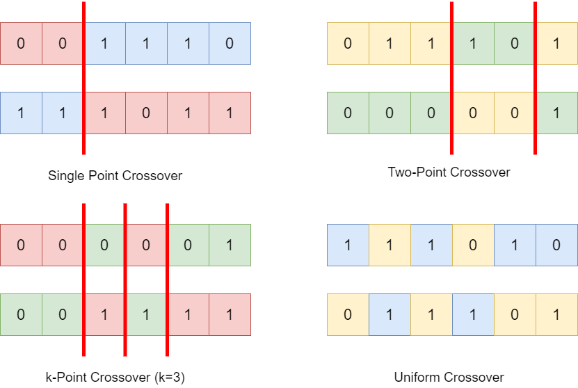

[](https://www.python.org/)
[](https://numpy.org/)

#  &nbsp; GeneticAlgorithm-ZeroOneKnapsack -

This project aims to solve the famous 0-1 Knapsack Problem using various versions of Genetic Algorithm. The various approaches for this are inspired from this [paper](https://ieeexplore.ieee.org/document/8324863).

## Index -

- [Introduction](#--geneticalgorithm-zerooneknapsack--)
- [Index](#index--)
- [Genetic Algorithm](#genetic-algorithm--)
	- [Problems with Genetic Algorithm](#problems-with-genetic-algorithm--)
	- [Restart-Base Genetic Algorithm](#restart-base-genetic-algorithm--)
	- [Island Genetic Algorithm](#island-genetic-algorithm--)
	- [Modified Genetic Algorithm](#modified-genetic-algorithm--)
	- [Steps in Traditional Genetic Algorithm](#steps-in-traditional-genetic-algorithm--)
- [Methodology](#methodology--)
	- [Representation](#representation--)
	- [Post Crossover and Mutation](#post-crossover-and-mutation--)
	- [Merging and Sorting](#merging-and-sorting--)
- [Installation](#installation--)
- [Usage](#usage--)
- [Files in the repository](#files-in-the-repository--)
- [Bibliography](#bibliography--)

## Genetic Algorithm -

<b>Problem</b>: The zero-one knapsack problem belongs to the category of combinatorial optimization problems. Combinatorial optimization problems typically involve the selection of an optimal solution from a finite set of solutions. An exhaustive search for these problems is usually not feasible as it may be computationally expensive. The problem's primary objective is filling a knapsack (or a backpack) of fixed size with the most profitable items from a set of items. Each item has an associated weight, and thus, selecting a specific item consumes its associated weight from the knapsack's fixed capacity. This type of problem is analogous to a resource allocation task where one may include or exclude a non-divisible job in a budget-bound or time-bound queue.

<p align="center">
	
	<br>
</p>	

<b>Proposed Approach</b>: Genetic Algorithms belongs to the class of Evolutionary Algorithms. General Algorithm is a population-based metaheuristic optimization Algorithm, governed by natural-selection. In the Algorithm, a population is `initialized` with a set of candidate solutions. Each candidate is distinguished by a specific set of properties called the <i>genotype or the chromosome</i>. An objective function calculates the fitness for each individual. The individuals with the highest fitness are `selected` from the current generation and are `crossed` to form new individuals. These individuals may then undergo `mutation` to form a new generation. This cycle is repeated until a satisfactory solution is obtained, or the maximum number of generations is exhausted.

<br>
<p align="center"></p>
<br>

#### Problems with Genetic Algorithm -

The primary two limitations of the Genetic Algorithms are

- its inability to <b>escape local optimums</b> (Local optimums refer to the points in the search space that the Algorithm mistakes for the best results preventing the Algorithm from converging to the best global results).

- <b>high time complexity</b> due to large search space and sequential nature of Genetic Operations.

#### Restart-Base Genetic Algorithm -

Restart-base Genetic Algorithm is an improvised version of the standard genetic algorithm which randomly generates a new generation and restarts the algorithm when it fails to find better results.

#### Island Genetic Algorithm -

Island Genetic Algorithm is a parallelized version of a genetic algorithm and includes running k-genetic algorithms in parallel.

#### Modified Genetic Algorithm -

The paper proposes a hybrid version of the Restart-base and Island genetic algorithms in order to overcome the limitations. The algorithm runs m-number of genetic algorithms in parallel over specified search spaces. The winners of each sub-genetic algorithms are added to a “Superior
Population”. An outer genetic algorithm is then deployed over the “Superior Population” to obtain the overall winner.

<p align="center">
	<br>
	
	<br>
	
	<br>
	
	<br>
	<i>Fig: Visualizing the Modified Genetic Algorithm</i>
	<br>
</p>

#### Steps in Traditional Genetic Algorithm -

<p align="justify">

<b>Step 1: Initialization</b> - <br>
The chromosomes or the genotype of the individuals in the initial population are typically generated at random. In some cases, these chromosomes may also result from a seed value, where the solution of the problem is likely to be found in a particular region of the search space.

<b>Step 2: Selection</b> - <br>
First, the fitness score of each individual is calculated by an objective function, which is decided based on the respective problem. This fitness score is an indication of how suitable the respective solution is for the problem. During each successive generation a portion of the current population with relatively higher fitness scores is allowed to move to the next stage.
Various schemes may be used in the selection stage, such as tournament selection, rank-based selection, roulette wheel selection, elitism selection, etc.

<br>
<p align="center">
	
	<br>
	<i>Fig: Selection</i>
</p>
<br>

<b>Step 3: Crossover</b> - <br>
Crossover involves the reproduction of a new generation from the selected individuals. It is a genetic operation used to combine the genetic information of two parents in order to generate new offspring.

<br>
<p align="center">
	
	<br>
	<i>Fig: Crossover</i>
</p>
<br>

<b>Step 4: Mutation</b> - <br>
Mutation is the genetic operation used to maintain genetic diversity after the crossover stages. It is analogous to biological mutation and alters the chromosomes of the children using one or more schemes such as bit-flip mutation, swap mutation, scramble mutation, etc.
In simple terms, mutation may be defined as a small random tweak in the chromosomes, to get a new
solution.

<br>
<p align="center">
	
	<br>
	<i>Fig: Mutation</i>
</p>
<br>

<b>Step 5: Termination</b> - <br>
The cycle of selection, crossover and mutation is repeated until one of the following conditions is met –<br>
<ul>
  <li>A solution is found that satisfies the threshold condition.</li>
  <li>The maximum number of iterations/cycles have been exhausted.</li>
  <li>The high ranking solutions’ fitness scores have become stagnant and show no or little improvement.</li>
  <li>Allocated computation/time resources have been exhausted.</li>
</ul>

<br>
<p align="center">
	
	<br>
	<i>Fig: Termination</i>
</p>
<br>

</p>

## Methodology -

#### Representation -

The genome of an individual in any generation can be represented as an array of binary bits, as shown below. The length of the genome is equal to the total number of items.

<br>
<p align="center">
	
	<br>
	<i>Fig: Representation: Genome of an Individual</i>
</p>
<br>

The initial population is stochastically generated and represented as a matrix, with each row as an individual genotype sequence.

<br>
<p align="center">
	
	<br>
	<i>Fig: Representation: Population</i>
</p>
<br>

#### Post Crossover and Mutation -

The crossover operation is applied over selected individuals using one of the schemes mentioned previously. This results in a completely new population. This Children Population is then mutated to increase the diversity in the population.

<br>
<p align="center">
	
	<br>
	<i>Fig: Crossover and Mutation over the Selected Population</i>
</p>
<br>

#### Merging and Sorting -

The Mutated Children are then merged with the individuals from the selected population.

<br>
<p align="center">
	
	<br>
	<i>Fig: Merging</i>
</p>
<br>

This new population is twice the original size, so it is sorted in descending order based on the fitness score for each of the individuals, and the lower 50% of the population is discarded.

<br>
<p align="center">
	
	<br>
	<i>Fig: Sorting and Resizing the Population</i>
</p>
<br>

## Installation -

```bash
pip3 install -r requirements.txt

or

pip install -r requirements.txt
```

## Usage - 

1. Use existing knapsack json files from `values` directory or generate a file with random values or create a custom file.
2. Change fname in the respective code.
3. Select the parameters such as `cycle`, `selection_percentage`, `k_parallel`, `restart_rate`, etc.

#### Traditional Genetic Algorithm -

```bash
python3 standard_genetic_algorithm.py
```

#### Restart-Base Genetic Algorithm -

```bash
python3 restart_base_genetic_algorithm.py
```

#### Island Genetic Algorithm -

```bash
python3 island_genetic_algorithm.py
```

#### Modified Genetic Algorithm -

```bash
python3 modified_genetic_algorithm.py
```

## Files in the repository -
The files in the repository are :

#### .DATA
This directory contains the images for the icons and other media for the README File.

#### brute_force.py
Contains the code for an exhaustive search to find the best solution for Knapsack Problem.

#### README.md
The description file containing details about the repository. The file that you looking at right now.

#### requirements.txt
This file contains the respective packages needed to be installed.

#### \_\_init__.py
The \_\_init__.py file is to make Python treat directories containing the file as packages.

#### generate_data.py
This file contains the Knapsack class for creating random weight-value vectors and writing it to json files.

#### restart_base_genetic_algorithm.py
This file contains the Restart-Base implementation of Genetic Algorithm.

#### island_genetic_algorithm.py
This file contains the Island implementation of Genetic Algorithm.

#### standard_genetic_algorithm.py
This file contains the Traditional implementation of Genetic Algorithm.

#### modified_genetic_algorithm.py
This file contains the implementation of Genetic Algorithm as proposed in the above mentioned paper.

#### values
This directory contains the json files containing the sample values created and used as test cases for Knapsack Problem.

## Bibliography -

- M. Montazeri, R. Kiani and S. S. Rastkhadiv, "A new approach to the Restart Genetic Algorithm to solve zero-one knapsack problem," 2017 IEEE 4th International Conference on Knowledge-Based Engineering and Innovation (KBEI), Tehran, 2017, pp. 0050-0053, doi: 10.1109/KBEI.2017.8324863.
- Playlist by YarpizProjects, you can check it out [here](https://www.youtube.com/playlist?list=PLgH3sgdvgO4TQagjfi1FmPcdBjIlmk5s9).

[]( https://github.com/shashank3199 )<br>
